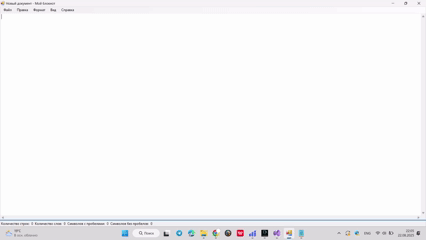

# 📝 TextEditor

**Простой текстовый редактор на C# для работы с текстовыми файлами**


## 📌 Описание

TextEditor — это приложение для создания, редактирования и сохранения текстовых документов.  
Предоставляет удобный и интуитивно понятный интерфейс для работы с текстовыми файлами.

## ⚙️ Функциональные возможности

- **Создание и сохранение текстовых документов**
- **Редактирование текста**: копирование, вставка, вырезание, удаление
- **Поиск и замена текста**

## 💻 Технологии

- **Язык программирования**: C#
- **Платформа**: .NET Framework
- **Среда разработки**: Microsoft Visual Studio

## 🚀 Установка и запуск

1. Клонируйте репозиторий:

   ```bash
   git clone https://github.com/Khelyus/TextEditor.git
